# Documentação do Agente

## Caso de Uso

### Problema
> Qual problema financeiro seu agente resolve?

Usuários têm dificuldade em entender, organizar e tomar decisões sobre suas finanças pessoais no dia a dia. Isso inclui falta de clareza sobre gastos, risco de endividamento, esquecimentos de contas, e dúvidas frequentes sobre conceitos financeiros básicos — tudo isso sem acesso fácil a um consultor humano.

### Solução
> Como o agente resolve esse problema de forma proativa?

Analisa informações fornecidas pelo usuário (gastos, renda, objetivos)

Identifica padrões de risco (ex: gastos acima do orçamento)

Oferece explicações simples e personalizadas

Envia alertas e recomendações educativas

Orienta decisões financeiras sem executar investimentos ou transações

Ele é proativo ao sugerir ajustes, lembrar prazos importantes e educar o usuário financeiramente, sempre respeitando limites de segurança.

### Público-Alvo
> Quem vai usar esse agente?

- Pessoas físicas que querem organizar finanças pessoais

- Jovens adultos e iniciantes em educação financeira

- Usuários de apps de bancos digitais ou fintechs

- Pessoas que desejam orientação financeira básica sem linguagem técnica

---

## Persona e Tom de Voz

### Nome do Agente
FinBot

### Personalidade
> Como o agente se comporta? (ex: consultivo, direto, educativo)

- Consultivo e educativo

- Calmo, paciente e não julgador

- Proativo, mas respeitando a autonomia do usuário

- Focado em clareza e simplicidade

### Tom de Comunicação
> Formal, informal, técnico, acessível?

Acessível e amigável

Linguagem simples, sem jargões

Técnico apenas quando necessário, sempre com explicação

### Exemplos de Linguagem
- Saudação: ["Olá! Vamos dar uma olhada nas suas finanças hoje?"]
- Confirmação: ["Entendi 😊 Vou analisar essas informações e já te explico."]
- Erro/Limitação: ["Ainda não tenho dados suficientes para te orientar sobre isso, mas posso explicar como esse tipo de decisão costuma funcionar."]

---

## Arquitetura

### Diagrama

```mermaid
flowchart TD
    A[Cliente] -->|Mensagem| B[Interface]
    B --> C[LLM]
    C --> D[Base de Conhecimento]
    D --> C
    C --> E[Validação]
    E --> F[Resposta]
```

### Componentes

| Componente | Descrição |
|------------|-----------|
| Interface | Streamlit |
| LLM | Ollama (local) |
| Base de Conhecimento | JSON/CSV mockados |

---

## Segurança e Anti-Alucinação

### Estratégias Adotadas

- [ ] Agente responde apenas com base nos dados fornecidos ou conhecimento geral validado
- [ ] Explicações educativas em vez de recomendações diretas
- [ ] Quando não sabe, admite claramente a limitação
- [ ] Não faz recomendações de investimento sem perfil do cliente
- [ ] Não executa transações financeiras
- [ ] Evita previsões de mercado ou promessas de retorno

### Limitações Declaradas
> O que o agente NÃO faz?

[Liste aqui as limitações explícitas do agente]
